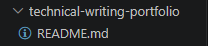

###############
Getting started
###############

Follow this tutorial to learn basic Git workflow.

Introduction
============

In this tutorial, you will learn:

1. How to create a repository.
2. How to create a new branch.
3. How to publish edited file to GitHub.
4. Open a pull request.
5. Merge a pull request.

What you will need:

* `Git <https://git-scm.com/>`_ versioning system.
* A GitHub account.
* `GitHub CLI <https://cli.github.com/>`_.
* Any editor that lets you edit text files. An :abbr:`IDE (Integrated Development Environment)` such as Visual Studio Code is recommended.

Create a repository
============================
First, you need to create a repository. 

1. Open the command line tool.
2. Enter ``gh repo create``.
3. Select **Create a new repository on github.com from scratch**.
   
   .. image:: _static/gh_repo_create.png
4. Enter repository name.
   
   .. image:: _static/repository_name.png
5. Add a description.

   .. image:: _static/description.png
6. Choose ``Public`` visibility. This will make the repository visible to others.
   
   .. image:: _static/visibility.png
7. Enter ``Y`` to add a **README.md** file.
   
   .. image:: _static/readme.png
8. On next two steps, simply press **Enter** to apply default settings.
   
   .. image:: _static/gitgnore_license.png
9.  Enter ``Y`` to confirm creating the repository. You will see a confirmation message.
    
    .. image:: _static/confirm.png
10. Enter ``Y`` to clone the new repository. This will create a copy of the repository on your computer.
    
    .. image:: _static/clone_locally.png

After perfoming the steps, you should see the following file structure:

